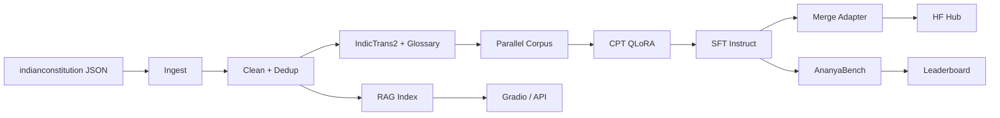

# ANANYA — System Architecture

## Vision

Sovereign, open, multilingual Indian **constitutional/legal SLM** ecosystem: parameter-efficient (QLoRA), RAG-grounded, Hugging Face-native, optimized for **free Colab T4**.

## Directory Structure

```
ANANYA/
├── configs/                    # YAML: base, training, glossary
├── data/
│   ├── raw/                    # Source JSON/JSONL (constitution, debates, SC)
│   ├── processed/              # Cleaned unified corpus
│   ├── splits/                 # train/val/test per stage
│   ├── indices/                # FAISS/Chroma stores
│   └── cache/translation_memory/ # SQLite TM
├── src/ananya/
│   ├── schemas/                # Pydantic: pretrain, instruct, RAG, eval, alignment
│   ├── data/                   # ingest, clean, splits, instruct builder
│   ├── translation/            # IndicTrans2 pipeline, terminology, cache
│   ├── training/               # CPT, QLoRA/SFT (Unsloth + PEFT fallback)
│   ├── evaluation/             # metrics, benchmark runner, leaderboard
│   ├── rag/                    # chunking, FAISS indexer, citation RAG
│   ├── inference/              # 4-bit load, generate, GGUF export hook
│   ├── hub/                    # HF push, model/dataset cards, semver tags
│   ├── cli/                    # entrypoints
│   └── utils/
├── scripts/
│   ├── data/prepare_corpus.py
│   ├── translate/run_indictrans2.py
│   ├── train/run_sft_colab.py
│   ├── rag/build_index.py
│   ├── eval/run_benchmarks.py
│   ├── hub/push_all.py
│   └── export/convert_to_gguf.sh
├── benchmarks/                 # AnanyaBench JSONL tasks
├── notebooks/                  # Colab orchestration
├── apps/
│   ├── gradio_demo.py
│   └── api/main.py             # FastAPI
├── docker/
├── docs/                       # ARCHITECTURE, RESEARCH, BRANDING
├── tests/
└── .github/workflows/ci.yml
```

## End-to-End Data Flow



## File Responsibilities (selected)

| Path | Role |
|------|------|
| `schemas/datasets.py` | Contract for all JSONL/HF dataset types |
| `data/constitution_ingest.py` | Bridge to `indianconstitution` package |
| `translation/terminology.py` | Mask/restore legal terms |
| `translation/pipeline.py` | Batch MT + retry + TM cache |
| `training/qlora.py` | Unsloth-first QLoRA SFT |
| `training/cpt.py` | Continued pretraining |
| `rag/indexer.py` | Multilingual embeddings → FAISS |
| `rag/pipeline.py` | Citation-aware prompts |
| `evaluation/runner.py` | AnanyaBench harness |
| `hub/push.py` | Dataset/model upload + tags |

## Implementation Order (12 weeks, solo researcher)

| Week | Milestone |
|------|-----------|
| 1 | Ingest constitution, clean, splits, instruct templates |
| 2 | IndicTrans2 pipeline + glossary validation |
| 3 | CPT on 1.5B (Unsloth), checkpoint to Drive |
| 4 | SFT instruct mix, merge adapters |
| 5 | RAG index + retrieval eval |
| 6 | AnanyaBench v0.1 + leaderboard |
| 7 | HF dataset + model cards, public release |
| 8 | Gradio Space + FastAPI Docker |
| 9 | GGUF export + llama.cpp CPU demo |
| 10 | Multilingual benchmark expansion |
| 11 | Ablation paper draft |
| 12 | Community / SOVEREIGN-AI governance doc |

## Colab T4 Memory Budget

| Setting | Value | Why |
|---------|-------|-----|
| Base model | Qwen2.5-**1.5B** | 3B tight on 15GB with 2k ctx |
| `max_seq_length` | 1024 CPT / 2048 SFT | Reduce if OOM |
| `batch=1`, `grad_accum=8–16` | Effective batch 8–16 |
| 4-bit NF4 + double quant | ~4× VRAM savings |
| Gradient checkpointing | −30% activation memory |
| Unsloth kernels | Faster + lower peak VRAM |
| `save_total_limit=2` | Disk on Colab |

**OOM recovery:** halve `max_seq_length`, increase `gradient_accumulation_steps`, disable `packing`, restart runtime.

## Hugging Face Naming

```
{org}/ananya-constitution-multilingual     # dataset
{org}/indic-legal-qwen2.5-1.5b-cpt-v0.1.0        # CPT adapter
{org}/ananya-1.5b-instruct-v0.1.0        # SFT adapter
{org}/indic-legal-qwen2.5-1.5b-merged-v0.1.0      # merged weights
{org}/indic-legal-embeddings-minilm               # optional embedding fine-tune
```

Tags: `v0.1.0`, `v0.1.1-patch`, `v0.2.0-minor` via `hub.push.bump_version`.

## API Architecture

```
Client → FastAPI /v1/query → RAG retrieve (FAISS) → prompt builder
                              → 4-bit QLoRA generate → citations JSON
```

CPU path: GGUF + llama.cpp server behind nginx; embeddings on CPU FAISS.

## CI/CD Recommendations

- **ci.yml**: ruff + pytest + schema validation (no GPU)
- **nightly.yml** (optional): smoke train 10 steps on A10 HF Spaces GPU
- **release.yml**: on tag `v*`, push to Hub + build Docker
- **dataset-pr.yml**: validate new JSONL against Pydantic schemas
- Pre-commit: ruff format, secret scan (no `.env` commits)

## Reproducibility

- Pin `requirements-colab.txt` + save `config` YAML in checkpoint dir
- Log seeds (`utils/seed.py`), W&B config artifact
- Version datasets with HF tags; never overwrite tags
- Document GPU type in model card (T4, driver, torch version)
